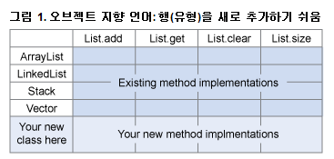
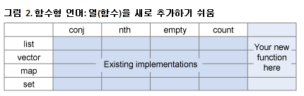
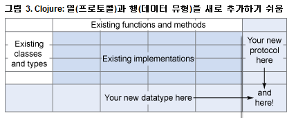

Clojure 1.2를 사용하여 Expression Problem 해결
==============================================


기존 유형을 새 메소드로 그리고 기존 메소드를 새 유형으로 확장

   Clojure 전문가인 Stuart Sierra가 고전적 프로그래밍 문제점인 Expression Problem을 해결할 수 있는 Clojure 1.2의 새로운 기능을 소개합니다. 프로토콜을 이용하면 기존 코드를 변경하지 않고도 기존 유형을 새 메소드로 확장할 수 있으며 데이터 유형을 이용하면 기존 메소드를 새 유형으로 확장할 수 있습니다. 또한, Java™ 인터페이스와 클래스가 Clojure 프로토콜 및 데이터 유형과 어떻게 상호 작용하는지를 확인합니다.


프로토콜은 JVM을 위한 동적 프로그래밍 언어인 Clojure 버전 1.2에 새로 도입된 기능이다. 프로토콜은 JVM 메소드 디스패치의 우수한 성능을 희생하지 않으면서도 Java 클래스 계층보다 더 유연한 오브젝트 지향 프로그래밍에 대한 접근 방식을 나타낸다. 프로토콜과 관련 기능인 데이터 유형은 Expression Problem을 해결할 수 있는 솔루션을 제공한다. Expression Problem을 해결하면 기존 코드를 모두 재컴파일하지 않고도 기존 유형을 새 메소드로 확장할 수 있을 뿐만 아니라 기존 메소드를 새 유형으로 확장할 수 있다.

### 다양한 유형, 하나의 인터페이스

Clojure의 핵심 기능 중 하나는 제네릭 데이터 조작 API이다. Clojure의 모든 내장 유형에서 작은 함수 세트를 사용할 수 있다. 예를 들면, conj 함수(conjoin의 단축형)는 다음 REPL 세션에 표시된 바와 같이 특정 콜렉션에 요소를 추가한다.

```clojure
user> (conj [1 2 3] 4)
[1 2 3 4]
user> (conj (list 1 2 3) 4)
(4 1 2 3)
user> (conj {:a 1, :b 2} [:c 3])
{:c 3, :a 1, :b 2}
user> (conj #{1 2 3} 4)
#{1 2 3 4}
 ```

conj 함수의 응답에서 각 데이터 구조는 약간 다르게 작동하지만(목록은 앞에서 늘어나고 벡터는 끝에서 늘어남), 모두 동일한 API를 지원한다. 이 예제는 하나의 균일한 인터페이스를 통해 여러 가지 유형을 액세스하는 개념인 다형성과 관련된 교과서적인 예제이다.

다형성은 강력한 기능이며 최신 프로그래밍 언어의 근간이 되는 요소 중 하나이다. Java 언어는 하위 유형 다형성이라고 하는 특정한 다형성을 지원한다. 따라서 유형 인스턴스(클래스)를 마치 그것이 또 다른 유형 인스턴스인 것처럼 액세스할 수 있다.

현실적으로 말하면 이는 오브젝트의 유형(ArrayList, LinkedList, Stack, Vector 등)에 관계없이 java.util.List와 같은 제네릭 인터페이스를 통해 오브젝트를 다룰 수 있다는 것을 의미한다. java.util.List 인터페이스에는 java.util.List 구현을 표방하는 모든 클래스가 이행해야 하는 계약이 정의되어 있다.


### Expression Problem

Bell Labs의 Philip Wadler는 1998년에 이메일로 배포한 널리 알려지지 않은 논문에서 Expression Problem이라는 용어를 새로 사용했다(참고자료 참조). 그의 표현에 따르면 "표현식 문제점은 이전에 있었던 문제점의 새로운 이름이다. 목표는 데이터 유형을 사례에 따라 정의하는 데 있으며 여기에서는 기존 코드를 재컴파일하지 않으면서 그리고 정적 유형을 안전하게 유지하면서 새 케이스를 데이터 유형에 추가하고 데이터 유형 전체에 새 함수를 추가할 수 있다.

Wadler의 논문에서는 Expression Problem을 설명하기 위해 행이 유형이고 열이 함수인 테이블의 개념을 사용한다. 오브젝트 지향 언어를 이용하면 그림 1과 같이 새 행, 즉 알려진 인터페이스를 확장하는 새 유형을 쉽게 추가할 수 있다.




그림 1에서는 각 열이 java.util.List 인터페이스의 메소드를 나타낸다. 단순하게 하기 위해 메소드를 네 개(List.add, List.get, List.clear, and List.size)만 삽입했다. 첫 번째 네 개의 행은 각각 java.util.List를 구현하는 클래스( ArrayList, LinkedList, Stack 및 Vector)를 나타낸다. 이러한 행과 열이 교차하는 셀은 각 클래스에 있는 이러한 메소드의 기존 구현(표준 Java 클래스 라이브러리에서 제공하는)을 나타낸다. 맨 아래에 추가된 다섯 번째 행은 java.util.List를 구현하는 새 클래스를 작성할 수 있는 행이다. 이 행의 각 셀에 java.util.List의 해당 메소드(특히 자신의 새 클래스에 적합한)의 자체 구현을 작성하게 된다.


오브젝트 지향 언어와는 대조적으로 일반적으로 함수형 언어를 사용하면 새 열, 즉 기존 유형으로 작동하는 새로운 함수를 쉽게 추가할 수 있다. Clojure의 경우에는 그림 2와 같은 형태가 된다.





그림 2는 그림 1과 비슷한 또 다른 테이블이다. 여기서는 열이 Clojure의 표준 콜렉션 API의 함수(conj, nth, empty 및 count)를 나타낸다. 마찬가지로 행은 Clojure의 내장 콜렉션 유형(list, vector, map 및 set)을 나타낸다. 이러한 행과 열이 교차하는 셀은 Clojure에서 제공하는 함수의 기존 구현을 나타낸다. 함수를 새로 정의하여 이 테이블에 열을 새로 추가할 수 있다. 새 함수를 Clojure의 내장 함수와 관련하여 작성했다고 가정하면 새 함수에서도 동일한 유형이 모두 자동으로 지원된다.
Wadler의 논문에는 Java 언어와 같이 정적으로 유형이 지정되는 언어에 관한 내용이 있다. Clojure는 동적으로 유형이 지정되며 오브젝트의 특정 유형은 선언할 필요가 없고 컴파일 시점에서 알려진다. 그러나 그렇다고 해서 Clojure가 Expression Problem에 자유로운 것은 아니다. 사실상 바뀐 것은 아무것도 없다. 동적으로 유형이 지정된다고 해서 Clojure에 유형이 없는 것은 아니다. 단지 모든 유형을 미리 선언하지 않아도 될 뿐이다. 이전 함수를 새 유형으로 확장하고 새 함수를 이전 유형으로 확장(Wadler의 테이블을 양 방향으로 확장)해야 하는 문제점이 동일하게 존재한다.
구체적인 사례

Expression Problem은 목록 및 세트와 같은 추상 유형에만 국한된 것은 아니다. 많은 시간을 오브젝트 지향 언어로 작업하는 데 사용해왔다면 아마도 Expression Problem에 대한 사례를 경험했을 것이다. 이 섹션에서는 단순하지만 구체적인 실제 사례를 살펴본다.

독자가 사무용품 통신 판매 회사인 WidgetCo의 IT 부서에서 근무하고 있다고 가정한다. WidgetCo에서는 Java 언어로 청구 및 재고 관리 소프트웨어를 자체적으로 작성했다.

WidgetCo의 제품은 모두 다음과 같은 간단한 인터페이스에 의해 기술된다.

```java
package com.widgetco;

public interface Widget {
    public String getName();
    public double getPrice();
}
```

WidgetCo에서 제작한 고유한 각 위젯 유형을 대상으로 IT 부서의 프로그래머?다.

WidgetCo의 고객 중 한 명의 주문은 해당 주문의 총비용을 계산하는 하나의 추가 메소드가 있는 Widget 오브젝트 목록으로 구현된다.

```java
package com.widgetco;

public class Order extends ArrayList< Widget > {
    public double getTotalCost() { /*...*/ }
}
```

Amagalmated Thingamabobs Incorporated에서 이 회사를 인수할 때까지는 WidgetCo에서 모든 것이 제대로 작동한다. Amalgamated에는 Java 언어로 작성된 자체 청구 시스템이 있다. 이 회사의 재고는 추상 클래스인 Product를 중심으로 이루어지며 이 클래스로부터 특정 product 클래스가 파생된다.

```java
package com.amalgamated;

public abstract class Product {
    public String getProductID() { /*...*/ }
}
```
Amalgamated에서는 제품에 정가가 없다. 그 대신에 이 회사는 각 고객과 협상을 하여 해당 품목을 주어진 가격에 특정 수량만큼 전달한다. 이러한 계약은 다음과 같이 Contract 클래스로 표현된다.

```java
package com.amalgamated;

public class Contract {
    public Product getProduct() { /*...*/ }
    public int getQuantity()    { /*...*/ }
    public double totalPrice()  { /*...*/ }
    public String getCustomer() { /*...*/ }
}
```

합병 후, Amagalmated의 새 상사는 합병된 회사에 맞는 송장과 적하 목록을 생성하는 새로운 애플리케이션을 작성하는 태스크를 독자에게 할당한다. 그러나 여기에는 주목해야 할 점이 있다. 새로운 시스템은 WidgetCo와 Amalgamated Thingamabobs에서 재고를 관리하는 데 사용된 기존 Java 코드(com.widgetco.Widget, com.widgetco.Order, com.amalgamated.Product 및 com.amalgamated.Contract 클래스)와 함께 작동해야 한다. 이러한 코드에 의존하는 다른 애플리케이션이 너무 많기 때문에 이러한 코드를 변경해서는 안 된다.

이것이 바로 Expression Problem이다.
가능한 "솔루션"

오브젝트 지향 언어는 Expression Problem을 해결할 수 있는 다양한 접근 방식을 제공하지만, 각 방식에는 단점이 존재한다. 아마도 독자는 이러한 각각의 기술에 대한 사례를 경험한 적이 있을 것이다.
공통 수퍼클래스로부터 상속

이러한 유형의 문제점을 해결할 수 있는 전통적인 오브젝트 지향 "솔루션"에서는 하위 유형 다형성, 즉 상속을 활용한다. 클래스 두 개에서 동일한 인터페이스를 지원해야 하는 경우, 이러한 클래스는 모두 동일한 수퍼클래스를 확장해야 한다. 필자의 예제에서 com.widgetco.Order와 com.amalgamated.Contract는 송장과 적하 목록을 생성해야 한다. 사실상, 두 클래스는 다음과 같은 필수 메소드가 있는 인터페이스를 일부 구현하게 된다.

```java
public interface Fulfillment {
    public Invoice invoice();
    public Manifest manifest();
}
```

이렇게 하려면 Order와 Contract의 소스 코드를 수정하여 새로운 인터페이스를 구현해야 한다. 그러나 이 예제에서는 이점에 문제가 있다. 해당 클래스의 소스 코드를 수정해서는 안 되기 때문이다. 또한, 소스 코드를 재컴파일할 수도 없다.
다중 상속

Expression Problem에 대한 또 다른 접근 방식은 다중 상속으로 이 방식에서는 서브클래스 하나를 여러 개의 수퍼클래스로 확장한다. 구매의 제네릭 표현(com.widgetco.Order 또는 com.amalgamated.Contract)이 필요하다. 다음 의사 코드에는 Java 언어에서 다중 상속을 지원했을 경우의 코드가 형태가 표시되어 있다.

```java
public class GenericOrder
        extends com.widgetco.Order, com.amalgamated.Contract
        implements Fulfillment {

    public Invoice invoice() { /*...*/ }

    public Manifest manifest() { /*...*/ }
}
```

그러나 Java 언어에서 구체적 다중 상속을 지원하면 클래스의 계층 구조가 복잡해지고 때로는 예측 불가능하게 되기 때문에 Java 언어는 구체적 클래스의 다중 상속을 지원하지 않는다. Java 언어는 인터페이스의 다중 상속을 지원하므로 Order와 Contract가 모두 인터페이스이면 이러한 기술을 활용할 수 있다. 그러나 유감스럽게도 Order와 Contract를 원래 작성한 개발자는 인터페이스에 근거해서 코드를 설계할 정도로 선견지명이 있지는 않았다. 그러나 그들에게 선견지명이 있었다고 하더라도 이 방법은 Expression Problem을 해결할 수 있는 진정한 솔루션이 아니다. 왜냐하면 기존의 Order와 Contract 클래스에 Fulfillment 인터페이스를 추가할 수 없기 때문이다. 그 대신 다음에 설명할 랩퍼와 동일한 문제점이 있는 GenericOrder 클래스를 새로 작성했다.
랩퍼

자주 사용되는 또 다른 솔루션은 작동을 수정할 클래스를 둘러싸는 랩퍼를 작성하는 것이다. wrapper 클래스는 원래의 클래스에 대한 참조로 구성되며 이 클래스에 메소드를 전달한다. Order 클래스용 Java 랩퍼는 다음과 같다.

```java
public class OrderFulfillment implements Fulfillment {
    private com.widgetco.Order order;

    /* constructor takes an instance of Order */
    public OrderFulfillment(com.widgetco.Order order) {
        this.order = order;
    }

    /* methods of Order are forwarded to the wrapped instance */

    public double getTotalCost() {
        return order.getTotalCost();
    }

    /* the Fulfillment interface is implemented in the wrapper */
    public Invoice invoice() { /*...*/ }

    public Manifest manifest() { /*...*/ }
}
```

OrderFulfillment는 Order를 둘러싸는 랩퍼이다. 이 랩퍼 클래스는 앞서 설명한 Fulfillment 인터페이스를 구현한다. 또한, Order에 정의된 메소드를 복사하여 전달한다. Order는 ArrayList< Widget >를 확장하기 때문에 올바르게 구현된 이 랩퍼 클래스는 java.util.ArrayList의 모든 메소드를 복사하여 전달해야 한다.

Fulfillment를 구현하는 또 다른 랩퍼(com.amalgamated.Contract용)를 작성하면 태스크의 요구사항을 충족시키게 되지만 더 복잡해진다. 랩퍼 클래스는 작성하기가 지루하다. (java.util.ArrayList에는 메소드가 30개 이상 있다.) 게다가 랩퍼 클래스는 해당 클래스에서 예상되는 특정 작동을 방해한다. OrderFulfillment가 Order와 동일한 메소드를 구현한다고 하더라도 이 랩퍼는 Order와는 차이가 있다. Order로 선언된 포인터를 통해 메소드를 액세스할 수 없을 뿐만 아니라 이 메소드를 Order를 인수로 기대하는 또 다른 메소드에 전달할 수도 없다. 랩퍼 클래스를 추가하면 하위 유형의 다형성이 방해를 받는다.

게다가 랩퍼 클래스는 식별을 방해한다. OrderFulfillment로 둘러싸인 Order는 더 이상 동일한 오브젝트가 아니다. Java의 == 연산자를 사용하여 OrderFulfillment를 Order와 비교할 수 없으며 그 결과로 true가 리턴될 것으로 예상할 수도 없다. OrderFulfillment가 Order와 "동일"하도록 OrderFulfillment에서 Object.equals 메소드를 오버라이드하려고 하면 등식은 대칭이 되어야 한다는 Object.equals의 계약을 위반하게 된다. Order는 OrderFulfillment에 대해 아무것도 알지 못하므로 OrderFulfillment를 전달했을 때, OrderFulfillment의 equals 메소드는 언제나 false를 리턴한다. Order를 전달했을 때 true를 리턴하도록 OrderFulfillment.equals를 정의하면 등식의 대칭성을 위반하게 되며, 이러한 작동에 의존하는 내장 Java 콜렉션 클래스와 같은 다른 클래스에서 단계적으로 실패가 발생한다. 이러한 사례가 주는 교훈은 식별과 관련된 문제점을 일으키지 말라는 것이다.
오픈 클래스

Ruby와 Javascript 언어 덕택에 오브젝트 지향 프로그래밍의 오픈 클래스 개념이 널리 보급되었다. 오픈 클래스는 이 클래스를 정의했을 때 구현된 메소드 세트로 제한되지 않는다. 누구나 언제든지 이 클래스를 "다시 열어서" 메소드를 추가하거나 기존 메소드를 대체할 수 있다.

오픈 클래스는 유연성과 재사용성이 매우 높다. 제네릭 클래스가 사용되는 다양한 위치에 적합한 기능으로 제네릭 클래스를 확장할 수 있다. 특정한 작동 특성을 구현하는 메소드 그룹을 이러한 작동을 필요로 하는 모든 클래스에 추가되는 하나의 클래스로 모두 수집할 수 있다. 이 기사의 예제를 Ruby나 Javascript로 작성하면 Order와 Contract 클래스를 간단히 열어서 필요한 메소드를 추가할 수 있다.

Java 언어를 포함한 대부분의 프로그래밍 언어에 오픈 클래스가 존재하지 않는다는 점 이외에도 오픈 클래스는 매우 유연하다는 점으로 인해 확실성이 부족하다는 단점을 갖고 있다. 클래스에서 invoice 메소드를 정의하면 이 클래스를 사용하는 다른 사용자가 invoice라는 이름의 호환되지 않은 다른 메소드를 정의하지 않을 것이라는 점을 알 수가 없다. 이러한 문제점은 오픈 클래스를 사용하지만 메소드에서 네임스페이스 메커니즘을 사용하지 않는 언어에서는 피하기 어려운 것으로 이름 충돌이라고 한다. 이러한 기술을 "monkey patching"이라고 부르는 이유가 있다. 이 기술은 이해하기 쉽고 간단하지만, 나중에는 거의 문제점이 발생한다.
조건부와 오버로딩

Expression Problem을 해결할 수 있는 가장 일반적인 솔루션 중 하나는 이전의 일반 if-then-else 논리이다. 조건문과 유형 확인을 사용하면 가능한 모든 경우를 열거하여 각각 적절하게 처리할 수 있다. 송장 예제의 경우에는 Java 언어의 정적 메소드로 이것을 구현할 수 있다.

```java
public class FulfillmentGenerator {
    public static Invoice invoice(Object source) {
        if (source instanceof com.widgetco.Order) {
            /* ... */
        } else if (source instanceof com.amalgamated.Contract) {
            /* ... */
        } else {
            throw IllegalArgumentException("Invalid source.");
        }
    }
}
```

랩퍼 클래스와 마찬가지로 이 기술도 해당 요구사항을 충족시키지만, 이 기술만의 단점이 존재한다. if-then-else 체인이 더 조잡하고 느려질수록 더 많은 유형을 처리해야 한다. 그리고 이 구현은 폐쇄적이기 때문에 FulfillmentGenerator 클래스를 구현한 후에는 소스 코드를 편집하고 재컴파일하지 않으면 invoice 메소드를 새 유형으로 확장할 수 없다. 사실상 Expression Problem에 대한 조건부 솔루션은 전혀 해결책이 되지 못하며 단지 미래에 유지보수 작업을 더 가중시킬 수 있는 미봉책에 불과하다.

다음 경우에는 다음과 같이 다양한 유형의 invoice 메소드를 오버로딩하여 조건부 논리를 회피할 수 있다.


```java
public class FulfillmentGenerator {
    public static Invoice invoice(com.widgetco.Order order) {
        /* ... */
    }

    public static Invoice invoice(com.amalgamated.Contract contract) {
        /* ... */
    }
}
```

이 방법은 동일한 목적을 달성하지만, 조건부 버전보다 더 효과적이다. 그러나 이 방법도 마찬가지로 폐쇄적이기 때문에 FulfillmentGenerator의 소스 코드를 수정하지 않고는 다양한 유형의 invoice 구현을 새로 추가할 수 없다. 또한, 상속 계층 구조에 직면해서는 그것을 예측할 수 없게 된다. Order나 Contract의 서브클래스를 위해 invoice 구현을 추가하고자 한다고 가정한다. Java 언어 전문가만 어떤 메소드 버전이 실제로 호출되는지 알려줄 수 있다. 그렇지만 이 메소드 버전이 원하는 것이 아닐 수도 있다.

Java 언어에는 Expression Problem을 해결할 수 있는 진정한 솔루션이 존재하지만(참고자료 참조), 이러한 솔루션은 간단한 비즈니스 문제점을 해결하기 위해 처리하고 싶은 것보다 훨씬 더 복잡하다. 일반적으로 여기에서 제시한 모든 비효과적인 솔루션은 실패하게 마련이다. 왜냐하면 이러한 솔루션에서는 유형이 상속, 식별 또는 네임스페이스와 융합된다. Clojure에서는 각 문제점을 별도로 처리한다.
프로토콜

Clojure 1.2에는 프로토콜이 도입되었다. 새로운 개념이 아니라고 하더라도(1970년대에 컴퓨터 과학자들이 비슷한 개념을 연구함), Clojure의 구현은 호스트 플랫폼인 JVM의 성능을 유지하면서 Expression Problem을 해결할 수 있을 정도로 유연하다.

개념적으로 프로토콜은 Java 인터페이스와 비슷하다. 프로토콜은 일련의 메소드 이름과 인수 시그너처를 정의하지만 구현은 하지 않는다. 송장 예제는 목록 1과 같은 형태가 된다.

목록 1. Fulfillment 프로토콜


```clojure
(ns com.amalgamated)

(defprotocol Fulfillment
  (invoice [this] "Returns an invoice")
  (manifest [this] "Returns a shipping manifest"))
```

각 프로토콜 메소드는 인수(this)를 하나 이상 받는다. Java 메소드와 마찬가지로 프로토콜 메소드는 오브젝트에서 호출되며 이 오브젝트의 유형으로 사용되는 메소드 구현을 결정한다. Java 언어와 달리 Clojure에서는 this를 함수의 명시적 인수로 선언해야 한다.

프로토콜이 정의되는 시점에서 프로토콜 메소드는 일반 함수로 존재한다는 점에서 프로토콜은 인터페이스와 다르다. 목록 1의 예제에서는 Clojure 함수, invoice와 manifest를 정의한다. 이 두 함수는 com.amalgamated 네임스페이스 안에서 실행된다. 물론, 이러한 함수에는 아직 구현이 없으므로 이러한 함수에 대한 호출은 throw를 사용하여 예외 처리한다.

프로토콜을 이용하면 사례별로 프로토콜 메소드의 구현을 제공할 수 있다. extend 함수를 사용하여 프로토콜을 새 유형으로 확장한다. extend 함수는 데이터 유형, 프로토콜 및 메소드 구현 맵을 받는다. 다음 섹션에서 데이터 유형을 설명하겠지만, 지금은 데이터 유형이 일반 Java 클래스라고 가정하자. 목록 2에 표시된 바와 같이 이전의 Order 클래스에서 작동하도록 Fulfillment 프로토콜을 확장할 수 있다.

목록 2. Order 클래스에서 작동하도록 Fulfillment 프로토콜을 확장


```clojure

(extend com.widgetco.Order
  Fulfillment
  {:invoice (fn [this]
              ... return an invoice based on an Order ... )
   :manifest (fn [this]
               ... return a manifest based on an Order ... )})
```

extend 함수로 전달되는 맵은 키워드에서 익명 함수로 맵핑을 한다. 키워드는 프로토콜 메소드의 이름이며 익명 함수는 이러한 메소드의 구현이다. extend를 호출하여 Fulfillment 프로토콜에게 "이 코드는 com.widgetco.Order 유형으로 이러한 메소드를 구현하기 위한 것이다"라고 전달하고 있다.

목록 3과 같이 Contract 클래스에 대해서도 동일한 작업을 수행할 수 있다.

목록 3. Contract 클래스에서 작동하도록 Fulfillment 프로토콜을 확장


```clojure

(extend com.amalgamated.Contract
  Fulfillment
  {:invoice (fn [this]
              ... return an invoice based on a Contract ... )
   :manifest (fn [this]
               ... return a manifest based on a Contract ... )})
```


이렇게 하고 나면 Order나 Contract에서 호출할 수 있고 올바르게 작동되는 다형적인 invoice와 manifest 함수가 생긴다. Expression Problem의 어려운 부분을 해결한 것이다. 다시 말해서 기존 코드를 수정하거나 재컴파일하지 않으면서 새 invoice와 manifest 함수를 기존의 Order와 Contract 유형에 추가했다.

오픈 클래스 방식에서와 달리 Order와 Contract 클래스를 변경하지 않았다. 또한, 다른 코드에서 다양한 구현이 있는 자체 invoice와 manifest 메소드를 정의하지 못하게 하지도 않았다. invoice와 manifest 메소드는 com.amalgamated 내에서 네임스페이스가 지정되었기 때문에 다른 네임스페이스에서 정의된 메소드와 결코 충돌하지 않는다.

일종의 Lisp인 Clojure는 매크로를 사용하여 일부 복잡하거나 반복적인 구문을 단순화한다. 내장 extend-protocol 매크로를 사용하면 목록 4와 같이 모든 메소드 구현을 하나의 블록으로 작성할 수 있다.

목록 4. extend-protocol 매크로 사용


```clojure
(extend-protocol Fulfillment
  com.widgetco.Order
    (invoice [this]
      ... return an invoice based on an Order ... )
    (manifest [this]
      ... return a manifest based on an Order ... )
  com.amalgamated.Contract
    (invoice [this]
      ... return an invoice based on a Contract ... )
    (manifest [this]
      ... return a manifest based on a Contract ... ))
```

이 매크로 코드는 목록 2와 목록 3에 있는 동일한 두 개의 extend 호출로 확장된다.
데이터유형

프로토콜은 강력한 도구로 원래의 코드를 수정하지 않고도 이름이 충돌하지 않게 기존 클래스에 메소드를 새로 삽입할 수 있는 기능을 효과적으로 제공한다. 그러나 프로토콜은 Expression Problem의 절반, 즉 Wadler 테이블의 "새 열"에 대한 문제점만 해결할 뿐이다. Clojure에서는 "새 행"을 테이블에 어떻게 추가할까?

해답은 바로 데이터 유형에 있다. 오브젝트 지향 환경에서는 데이터 유형이 클래스와 동일한 역할을 한다. 데이터 유형은 상태(필드)와 작동(메소드)을 캡슐화한다. 그러나 Java와 같은 주류 오브젝트 지향 언어는 오브젝트 지향 설계에서 클래스가 이행할 수 있는 다양한 역할을 융합하는 경향이 있다. Clojure의 데이터 유형은 별도의 두 가지 역할로 나누어진다.
구조화된 데이터: defrecord

클래스는 구조화된 데이터의 컨테이너로 사용될 수 있다. 거의 모든 오브젝트 지향 프로그래밍 교과서에서는 다음과 같이 시작한다. 독자에게 Name 및 Age와 같은 필드가 있는 Person 클래스가 있다. 이러한 필드를 직접 액세스하거나 게터/세터 메소드를 통해 액세스하거나 이점은 중요하지 않으며, 이 클래스 자체는 C의 구조체 역할을 한다. 이 클래스의 목적은 논리적으로 관련된 일련의 값을 유지하는 데 있다. JavaBeans는 구조화된 데이터를 유지하는 데 사용되는 클래스의 예이다.

구조화된 데이터를 유지하기 위해 클래스를 사용하는 데 따르는 문제점은 각 클래스에는 일반적으로 게터/세터 메소드를 통해 구조화된 데이터를 액세스하는 데 필요한 별도의 자체 인터페이스가 있다는 점이다. Clojure에서는 균일한 인터페이스를 선호하기 때문에 구조화된 데이터를 맵에 저장하게 한다. Clojure의 맵 구현인 HashMap, ArrayMap 및 StructMap은 모두 이 기사의 앞 부분에서 설명한 제네릭 데이터 조작 인터페이스를 지원한다. 그러나 맵에는 구조화된 데이터에서 기대할 수 있는 기능이 일부 부족하다. 맵에는 실질적인 "유형"이 없으며(추가되는 메타데이터가 없음), 클래스와 달리 새 작동으로 확장할 수도 없다.

Clojure 1.2에서 프로토콜과 함께 도입된 defrecord 매크로는 맵과 클래스의 기능이 결합된, 구조화된 데이터용 컨테이너를 작성하기 위해 사용될 수 있다.

이 기사의 실행 예제로 돌아가서 Amalgamated Thingamabobs Incorporated의 경영진이 고객의 구매 프로세스를 통합하기로 결정했다고 가정하자. 지금부터는 신규 제품 주문은 PurchaseOrder 오브젝트로 표현되고 이전의 Order와 Contract 클래스는 단계적으로 폐지된다.

PurchaseOrder에는 "date," "customer" 및 "products" 특성이 있다. 또한, PurchaseOrder는 invoice와 manifest 구현을 제공해야 한다. PurchaseOrder는 Clojure의 defrecord로서 목록 5와 같이 표현된다.

목록 5. PurchaseOrder 데이터 유형


```clojure
(ns com.amalgamated)

(defrecord PurchaseOrder [date customer products]
  Fulfillment
    (invoice [this]
      ... return an invoice based on a PurchaseOrder ... )
    (manifest [this]
      ... return a manifest based on a PurchaseOrder ... ))
```


PurchaseOrder 다음에 오는 벡터는 데이터 유형의 필드를 정의한다. defrecord에서는 이러한 필드 이후에 프로토콜 메소드의 인라인 정의를 작성할 수 있다. 목록 5에서는 Fulfillment 프로토콜만 구현하지만, 다른 프로토콜과 그 구현이 얼마든지 따라올 수 있다.

defrecord는 date, customer 및 products 필드가 있는 Java 클래스를 작성한다. PurchaseOrder 인스턴스를 새로 작성하려면 목록 6과 같이 일반적인 방법으로 생성자를 호출하고 필드 값을 제공한다.

목록 6. PurchaseOrder 인스턴스 새로 작성


```clojure
(def po (PurchaseOrder. (System/currentTimeMillis)
                        "Stuart Sierra"
                        ["product1" "product2"]))
```

이 인스턴스가 구성되면 defrecord에서 제공한 구현을 사용하는 PurchaseOrder 오브젝트에서 invoice와 manifest 함수를 호출할 수 있다. 그러나 Clojure 맵처럼 PurchaseOrder 오브젝트를 처리할 수도 있다. defrecord는 Clojure의 맵 인터페이스를 구현하는 데 필요한 메소드를 자동으로 추가한다. 다음 REPL 세션에서와 같이 Clojure의 표준 맵 함수를 사용하여 필드를 이름(키워드)으로 검색하여 이러한 필드를 업데이트할 수 있을 뿐만 아니라 원래의 정의에 있지 않은 필드를 새로 추가할 수도 있다.

```clojure
com.amalgamated> (:date po)
1288281709721
com.amalgamated> (assoc po :rush "Extra Speedy")
#:com.amalgamated.PurchaseOrder{:date 1288281709721,
                                :customer "Stuart Sierra",
                                :products ["product1" "product2"],
                                :rush "Extra Speedy"}
com.amalgamated> (type po)
com.amalgamated.PurchaseOrder
```

레코드 유형을 인쇄하면 앞에 type 태그가 추가로 첨부된 맵과 같은 형태가 된다. 이러한 유형은 Clojure의 type 함수를 사용하여 검색할 수 있다. 개발 과정에서는 맵과 레코드 유형이 동일한 인터페이스를 따른다는 사실이 특히 편리하다. 보통의 맵으로 시작하다가 추가 기능이 필요해지면 코드를 수정하지 않고도 레코드 유형으로 전환할 수 있다.
순수 작동: deftype

모든 클래스가 애플리케이션 도메인에서 구조화된 데이터를 표현하는 것은 아니다. 다른 유형의 클래스는 일반적으로 콜렉션(예: ArrayList, HashMap, SortedSet)이나 값(예: String, Date, BigDecimal)과 같이 특정 구현에 고유한 오브젝트를 표현한다. 이러한 클래스는 자체적으로 제네릭 인터페이스를 구현하므로 이러한 클래스가 Clojure 맵과 같이 작동하는 것은 합당하지 않다. 이러한 역할을 이행하기 위해 Clojure는 레코드가 아닌 것을 처리할 수 있는 변형된 데이터 유형을 제공한다. deftype 매크로에는 defrecord와 같은 구문이 있지만, 이 매크로는 맵과 같은 기능을 사용하지 않고 핵심 Java 클래스를 작성한다. 클래스의 모든 작동은 프로토콜 메소드로 구현되어야 한다. 일반적으로 deftype을 사용하여 새로운 콜렉션을 구현하거나 지정된 프로토콜을 중심으로 완전히 새로운 추상화를 정의한다.

데이터 유형에서 일부러 제외한 한 가지 기능은 특정 프로토콜에 정의되어 있지 않은 메소드를 구현하는 기능이다. 데이터 유형은 데이터 유형에서 구현되는 프로토콜과 그 필드에 의해 완전히 지정되어야 한다. 이렇게 해야 데이터 유형에서 호출된 함수가 언제나 다형적이 된다. 모든 데이터 유형은 동일한 프로토콜을 구현하는 한, 또 다른 데이터 유형으로 대체될 수 있다.
Java 코드와 상호 작용

지난 몇 달 동안 독자는 Amalgamated Thingamabobs Incorporated의 프로덕션 시스템에 Clojure 코드를 일부 추가했다. 이 코드는 JAR 파일로 컴파일되었으며 다른 프로그래밍 팀에서는 결코 눈치채지 못했다. 그런데, Java 전용 개발자로 구성된 팀에서 독자가 작성한 Clojure 코드와 호환 가능한 또 다른 송장 생성기를 빌드해야 하게 되었다. 그래서 그들과 Clojure, Lisp 및 Expression Problem에 관해 논의하기 시작했지만 그들은 관심을 보이지 않았다.

결국, "아무런 문제도 없어요. Java 클래스로 이 인터페이스를 구현하면 되요"라고 말하고는 그들에게 다음과 같은 코드를 보여주었다.

```java
package com.amalgamated;

public interface Fulfillment {
    public Object invoice();
    public Object manifest();
}
```

이미 Clojure는 독자가 앞서 정의한 프로토콜을 이 인터페이스를 나타내는 JVM 바이트 코드에 컴파일했다. 사실상, 모든 Clojure 프로토콜은 이름과 메소드가 동일한 Java 인터페이스이기도 하다. 주의해서 이름을 지정하면 다시 말해서, 메소드 이름에 Java 언어에서 유효하지 않은 특정 문자를 사용하지 않으면, 다른 Java 개발자들이 Clojure로 인터페이스를 생성했다는 것을 전혀 알지 못해도 인터페이스를 구현할 수 있다.

데이터 유형에서 생성된 클래스가 Java 개발자가 예상하는 것과는 약간 다를 수도 있지만, 데이터 유형에서도 마찬가지이다. 목록 5에서 정의한 PurchaseOrder 데이터 유형은 다음과 같은 클래스의 바이트 코드를 생성한다.

```java
public class PurchaseOrder
    implements Fulfillment,
               java.io.Serializable,
               java.util.Map,
               java.lang.Iterable,
               clojure.lang.IPersistentMap {

    public final Object date;
    public final Object customer;
    public final Object products;

    public PurchaseOrder(Object date, Object customer, Object products) {
        this.date = date;
        this.customer = customer;
        this.products = products;
    }
}
````


데이터 유형의 필드는 Clojure의 변경되지 않는 데이터 정책에 따라 public final로 선언된다. 그리고 생성자를 통해서만 초기화될 수 있다. 이 클래스가 Fulfillment 인터페이스를 구현한다는 것을 알 수 있다. 다른 인터페이스는 Clojure의 데이터 조작 API의 기초가 되지만, defrecord 대신 deftype을 사용하여 작성한 데이터 유형에는 존재하지 않는다. 데이터 유형은 Clojure 프로토콜로 생성한 메소드뿐만 아니라 모든 Java 인터페이스의 메소드를 구현할 수 있다.
Clojure에는 관용적인 Clojure라고 하기보다는 관용적인 Java에 더 가까운 코드를 생성하는(이것이 유일한 옵션인 경우) 다른 형태의 Java interop이 있다.

결론

Expression Problem은 오브젝트 지향 프로그래밍에서 실제로 발생하는 실질적인 문제점이며 이 문제점을 해결하기 위해 가장 일반적으로 사용되는 솔루션은 적합하지 않다. Clojure 프로토콜과 데이터 유형은 간단하고 멋진 솔루션을 제공한다. 프로토콜을 이용하면 기존의 유형 전체에서 다형적인 함수를 정의할 수 있다. 데이터 유형을 이용하면 기존 함수를 지원하는 새 유형을 작성할 수 있다. 결과적으로 프로토콜과 데이터 유형을 이용하면 그림 3과 같이 코드를 양방향으로 확장할 수 있다.




그림 3에는 그림 1과 그림 2를 수정하여 작성한 이 테이블의 최종 버전이 표시되어 있다. 열은 이미 존재하는 함수나 메소드를 나타낸다. 행은 이미 존재하는 클래스(Java)와 데이터 유형(Clojure)을 나타낸다. 행과 열의 교차점은 변경하기를 원하지 않거나 변경할 필요가 없는 기존의 모든 구현을 나타낸다. Clojure 데이터 유형을 이 테이블의 맨 아래에 있는 새 행에 새로 추가할 수 있으며 Clojure 프로토콜을 이 테이블 오른쪽에 있는 새 열에 새로 추가할 수 있다. 게다가 새 프로토콜을 새 데이터 유형으로 확장하여 오른쪽 맨 아래에 있는 새 행에 채울 수 있다.

이 기사에서 설명한 것 이외에도 여러 가지 Expression Problem 솔루션이 사용 가능하다. 비록 수행하는 것이 만족스럽지는 못했지만, Clojure 자체에는 훨씬 더 유연하고 다양한 다형성을 제공하는 멀티 메소드가 언제나 있었다. 멀티 메소드는 Common Lisp와 같은 기타 언어의 제네릭 함수와 비슷하다. 또한, Clojure의 프로토콜은 Haskell의 type 클래스와 비슷하다.

모든 프로그래머는 조만간 Expression Problem을 경험하게 되므로 모든 프로그래밍 언어에는 이에 대한 해결책이 일부 있다. 흥미로운 실험으로서 프로그래밍 언어(독자가 잘 알거나 학습 중인 언어)를 선택하고 이 기사에서 제시한 예제와 같은 문제점을 해결하기 위해 그 언어를 어떻게 사용하는지를 생각해 보자. 기존 코드를 수정하지 않고도 문제점을 해결할 수 있는가? 식별을 위반하지 않고도 문제점을 해결할 수 있는가? 이름이 충돌하지 않는다고 확신할 수 있는가? 그리고 가장 중요한 것으로서 미래에 훨씬 더 심각한 문제점을 발행하지 않으면서 문제점을 해결할 수 있는가?

출처 : 한국IBM
